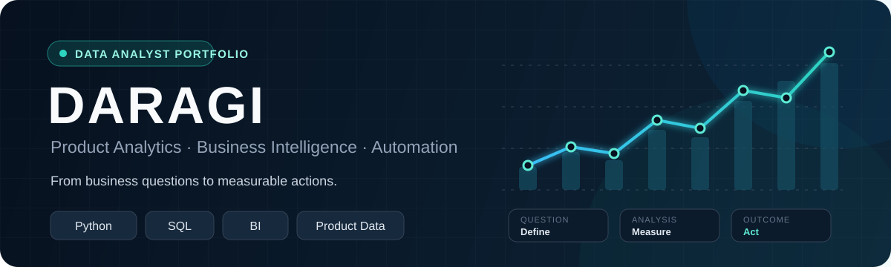

  

<b>데이터를 이해하고, 의사결정에 필요한 다음 액션을 만듭니다.</b>

  
  
  
  

## What I can do

<table>
  <tr>
    <td width="33%" align="center">
      <b>Product Analytics</b> 
      KPI · Funnel · Cohort · Retention
    </td>
    <td width="33%" align="center">
      <b>BI & Visualization</b> 
      데이터 분석 · 대시보드 · 액션 제안
    </td>
    <td width="33%" align="center">
      <b>Data & Automation</b> 
      SQL · API · ETL · 업무 자동화
    </td>
  </tr>
</table>

## GitHub activity

  

  
  

학습과 프로젝트 진행 과정을 꾸준히 공개합니다. <a href="https://github.com/daragi?tab=overview"><b>전체 기여 기록 보기 →</b></a>

## Selected work

| Project | Capability |
| :--- | :--- |
| [Startie](https://github.com/daragi/Startie) | 사용자 행동 · 전환 퍼널 · Aha Moment |
| [Blinkit BI](https://github.com/daragi/Blinkit_BI) | KPI · 매출/마진/재고 · BI 대시보드 |
| [Enernet](https://github.com/daragi/Enernet) | 운영 데이터 · 오류 탐지 · 업무 자동화 |
| [MediPort Data](https://github.com/medicrew-team/mediport-data) | 데이터 수집 · ETL · DB 설계 |

<b>Question → Data → Insight → Action</b>

